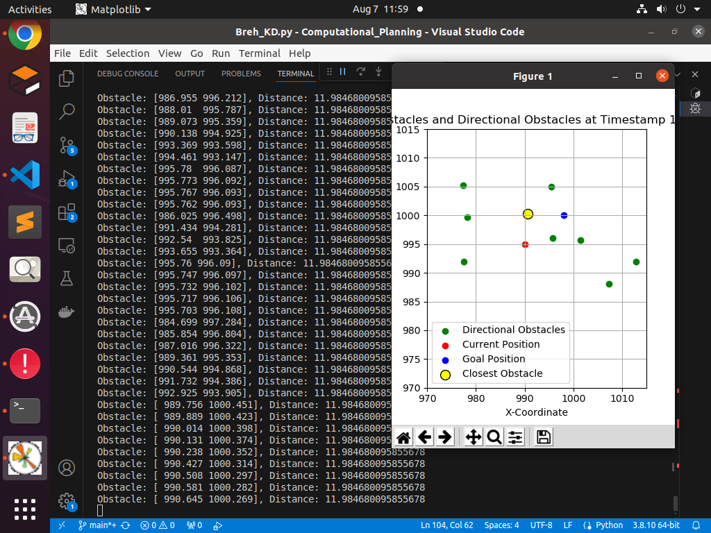
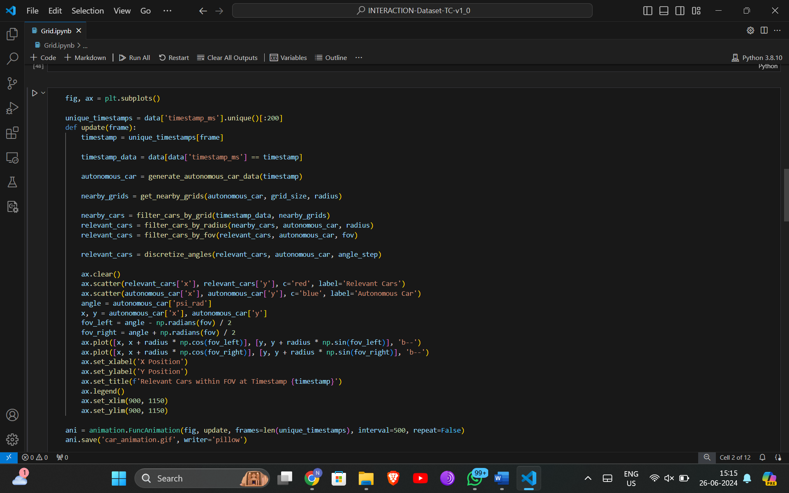

# Computational_Planning
Motion Planning based on Computational Geometry 

## Brehemnsan Algorithm 
The approach focuses on finding or clustering the obstacles in our direction. We do this by the vector projection concept. This works as a directional filter which projects the obstacles on our direction of approach by computing how much of each obstacle's relative position to the current position is in the direction of movement. It is crucial that the projection must not only be positive but also in the actual direction of the vector to ensure the obstacle is ahead and not behind.

Once, the obstacles that lie in our direction is taken care we move forward to find the obstacle that is closest to us. 
[Doc](https://docs.google.com/document/d/1HwhR370o9kS2Lb4gRbg8JsDy_vtT5b6vlm_0Y4IKhEk/edit)

## The K-D_Tree Implementation
[Doc](https://medium.com/smucs/a-look-into-k-dimensional-trees-290ec69dffe9#:~:text=What%20is%20a%20K%2DDimensional,in%20the%20multi%20dimensional%20space.)

## Results 

## Grid Partitioning
[Doc](https://docs.google.com/document/d/1h5gE9apKF-Ykxpte6mRMIKQhAqh1xXK2J0Vk6-Jg9VI/edit?usp=sharing)

## Results

